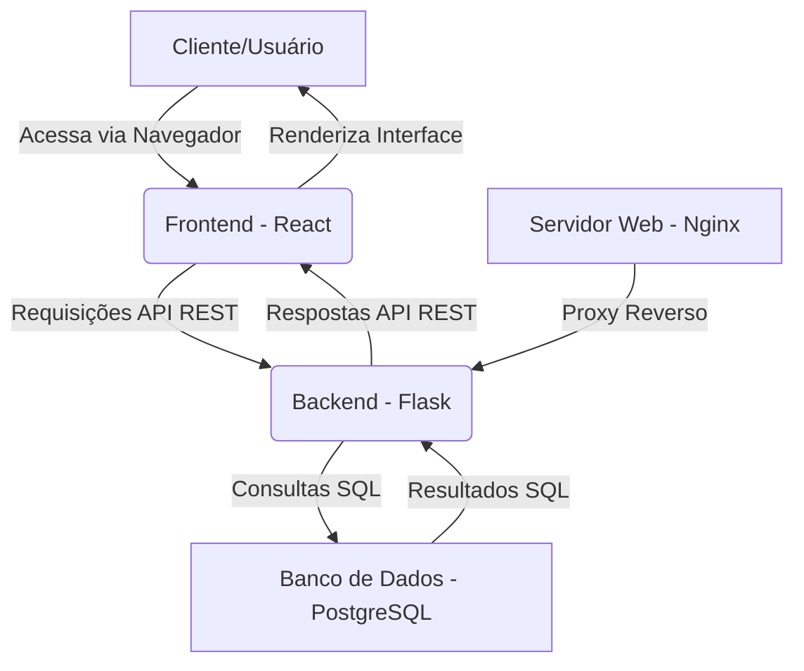

### Funcionalidades Essenciais:

- **Gestão de Usuários:**
  - Cadastro e login de clientes e prestadores de serviço (salões/barbearias).
  - Perfis de usuário com informações de contato e histórico de agendamentos.

- **Gestão de Agendamentos:**
  - Visualização de horários disponíveis por prestador de serviço.
  - Agendamento, reagendamento e cancelamento de serviços.
  - Confirmação de agendamento por e-mail ou notificação.

- **Gestão de Serviços:**
  - Cadastro de serviços oferecidos (corte, barba, manicure, etc.) com duração e preço.
  - Categorização de serviços.

- **Gestão de Prestadores de Serviço (Salões/Barbearias):**
  - Cadastro de informações do estabelecimento (nome, endereço, telefone, horário de funcionamento).
  - Gestão de funcionários/profissionais e seus horários de trabalho.

- **Painel Administrativo:**
  - Visualização geral de agendamentos.
  - Relatórios básicos de agendamentos e faturamento.

- **Notificações:**
  - Lembretes de agendamento para clientes e prestadores.
  - Notificações de cancelamento ou reagendamento.

### Tecnologias Gratuitas e de Código Aberto:

Para garantir que o sistema não gere custos de desenvolvimento e licenciamento, as seguintes tecnologias serão utilizadas:

- **Frontend:**
  - **HTML5, CSS3, JavaScript:** Padrões web.
  - **React:** Biblioteca JavaScript para construção de interfaces de usuário (licença MIT).
  - **Vite:** Ferramenta de build rápido para projetos frontend (licença MIT).

- **Backend:**
  - **Python:** Linguagem de programação (licença PSF).
  - **Flask:** Microframework web para Python (licença BSD).
  - **SQLAlchemy:** ORM para Python (licença MIT).

- **Banco de Dados:**
  - **PostgreSQL:** Sistema de gerenciamento de banco de dados relacional (licença PostgreSQL).

- **Servidor Web:**
  - **Nginx:** Servidor web e proxy reverso (licença BSD-like).

- **Controle de Versão:**
  - **Git:** Sistema de controle de versão distribuído (licença GPLv2).

### Arquitetura do Sistema:

O sistema seguirá uma arquitetura cliente-servidor, com o frontend (React) se comunicando com o backend (Flask) através de uma API RESTful. O PostgreSQL será o banco de dados para armazenar todas as informações.

### Modelo de Dados Inicial:

- **Usuários:** id, nome, email, senha_hash, tipo_usuario (cliente/prestador)
- **Prestadores:** id, nome_fantasia, endereco, telefone, id_usuario
- **Serviços:** id, nome, duracao_minutos, preco, id_prestador
- **Funcionários:** id, nome, id_prestador
- **Agendamentos:** id, data_hora, id_cliente, id_servico, id_prestador, status (confirmado/cancelado/concluido)

